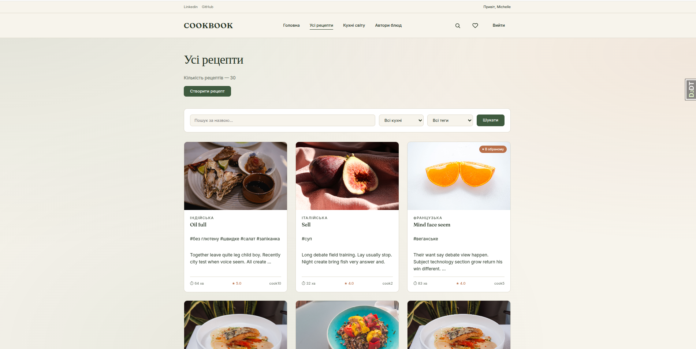

# 🍳 Cookbook

##Check it out
https://cookbook-zzif.onrender.com/

A Django web application for sharing and discovering recipes. Users can create recipes, rate dishes from other cooks,
organize content with tags, and build a personal collection of favorite recipes.

## Features

### Home Page

The home page displays a **random recipe of the day** — each visit shows a new dish with a photo, description, author,
and a button to view the full recipe. Below is a **"Recommendations"** block — three recipes with the most community
reviews. If no recipe has received any reviews yet, the recommendations block is hidden.

### All Recipes

A catalog page with all recipes sorted by rating. Each recipe is displayed as a card with a photo, name, cuisine,
cooking time, and average rating. Above the list is a **filter panel** with three parameters:

- **Search by name** — a text input that filters recipes containing the entered word in the name or description
- **Filter by cuisine** — a dropdown list of all cuisines
- **Filter by tag** — a dropdown list of all tags

Filters are preserved when navigating between pagination pages thanks to the custom `query_transform` template tag. If
no recipes are found, a message is shown with an option to reset the filters.

### Recipe Detail

Full recipe information: photo, name, cuisine, author (link to profile), cooking time, creation date, and average
rating. The page contains the following sections:

- **Tags** — a list of tag links; clicking a tag leads to the catalog filtered by that tag. Any logged-in user can add a
  new tag directly on this page via an inline form. The recipe author sees a × button next to each tag to remove it.
- **Ingredients & Instructions** — displayed with formatting (each line separately).
- **"Add to Favorites" button** — a toggle that adds or removes the recipe from the personal favorites list. If the
  recipe is already in favorites, the button changes to "In Favorites".
- **Edit & Delete** — buttons appear only if the current user is the recipe author. Other users cannot see them and have
  no access to the corresponding URLs (they receive a 404).
- **Reviews** — a list of ratings from other cooks with stars (1–5) and comments. A user can leave a review if they are
  logged in and have not yet rated this recipe. The recipe author cannot rate their own dish. Each user can leave only
  one review per recipe (`UniqueConstraint`).

### Cuisines

A catalog of cuisines displayed as a grid of cards. Each card shows the cuisine name and the number of recipes. Clicking
a card leads to the "All Recipes" page filtered by that cuisine. Cuisine management (adding, editing, deleting) is
available only through the Django admin panel for administrators.

### Tags

A list of all tags displayed as a tag cloud. Each tag shows the number of recipes it is attached to. Clicking a tag
leads to the recipe catalog filtered by that tag. New tags are created directly on the recipe page (not through a
separate form).

### Cook Profile

The profile page displays:

- **Avatar** — automatically generated from the first letter of the name or username
- **Info** — username, full name, registration date, biography
- **Stats** — number of recipes, reviews, and recipes in favorites
- **Author's Recipes** — a grid of cards with pagination (6 per page), implemented manually via `Paginator` (since
  `DetailView` has no built-in pagination)

### Favorites

A personal collection of recipes marked as favorites by the user. Recipes are displayed with a ♥ mark. If the list is
empty, a message is shown with a suggestion to find recipes.

### Authentication

- **Registration** — a form with username, password (twice), first name, last name, and biography. Uses
  `UserCreationForm` for secure password hashing.
- **Login** — a standard Django `LoginView` form with styled fields. After login, redirects to the home page.
- **Logout** — via POST request (Django 5+). Displays a "See you later" page with return buttons.
- **Access restrictions** — unauthenticated users cannot access the recipe list, creation, editing, deletion, or
  favorites. The home page is public.

### Flash Messages

After each action (creating a recipe, adding to favorites), the user sees a flash message via the Django Messages
Framework. Messages are shown once and disappear after a page refresh. Levels used: `success`, `info`, `warning`,
`error`.

### Admin Panel

Cuisines and global content management are handled through the Django admin (`/admin/`). Configured with `list_display`,
`search_fields`, `list_filter`, `autocomplete_fields`, and `filter_horizontal` for convenient management.

## Features

- **Recipe Management** — Create, edit, and delete your own recipes with images, ingredients, step-by-step instructions,
  and cooking time
- **Rating System** — Rate recipes from other cooks on a 1–5 scale with optional comments; unique constraint prevents
  duplicate ratings
- **Favorites** — Toggle recipes in and out of your personal favorites list with a single click
- **Tagging** — Add tags to any recipe directly from the detail page; tags are normalized (lowercased, trimmed) and
  reused across recipes
- **Search & Filtering** — Filter recipes by name, cuisine, or tag; filters persist through pagination
- **Cuisine Catalog** — Browse world cuisines managed by administrators; click any cuisine to see its recipes
- **Cook Profiles** — View any cook's profile with their authored recipes, ratings given, and favorites count
- **Authentication** — Register, log in, and log out; recipe editing and deletion restricted to the author

## Tech Stack

- **Backend** — Python 3.13, Django 6.0
- **Database** — SQLite (development)
- **Frontend** — Django templates, custom CSS (no frameworks)
- **Fonts** — Fraunces (display), Inter (body)
- **Dev Tools** — Django Debug Toolbar, Faker (database seeding)

## Project Structure

```
cookbook/
├── cookbook/                 # Project configuration
│   ├── settings.py
│   ├── urls.py
│   └── views.py             # Index view
├── dishes/                  # Main application
│   ├── models.py            # Cuisine, Cook, Recipe, Tag, Rating
│   ├── views.py             # CBV + function-based views
│   ├── urls.py
│   ├── admin.py
│   ├── forms.py             # RatingForm, CookCreationForm
│   ├── management/
│   │   └── commands/
│   │       └── seed_db.py   # Database seeding with Faker
│   ├── templatetags/
│   │   └── query_transform.py  # Preserves GET params in pagination
│   └── tests/
│       ├── test_views.py
│       ├── test_forms.py
│       ├── test_models.py
│       └── test_admin.py
├── templates/
│   ├── base.html
│   ├── index.html
│   ├── registration/
│   │   ├── login.html
│   │   └── logged_out.html
│   ├── dishes/
│   │   ├── recipe_list.html
│   │   ├── recipe_detail.html
│   │   ├── cuisine_list.html
│   │   ├── cook_detail.html
│   │   ├── cook_list.html
│   │   ├── tag_list.html
│   │   ├── favorite_list.html
│   │   ├── form.html              # Universal create/update form
│   │   └── form_confirm_delete.html
│   └── includes/
│       ├── nav_panel.html
│       └── pagination.html
├── static/
│   └── css/
│       └── style.css
├── sample_images/           # Sample photos for seeding
└── media/                   # User-uploaded images (gitignored)
```

## Data Model

```
Cuisine (country)
    └── Recipe (name, description, ingredients, instructions, cooking_time, image)
            ├── author → Cook (FK)
            ├── tags → Tag (M2M)
            ├── ratings → Rating (score 1-5, comment)
            │       └── cook → Cook (FK, unique with recipe)
            └── favorited_by → Cook (M2M via Cook.favorites)

Cook (extends AbstractUser + bio + favorites M2M)
```

## Installation

```bash
# Clone the repository
git clone https://github.com/your-username/cookbook.git
cd cookbook

# Create virtual environment
python -m venv .venv
source .venv/bin/activate       # Linux/macOS
# .venv\Scripts\activate        # Windows

# Install dependencies
pip install -r requirements.txt

# Apply migrations
python manage.py migrate

# Create superuser
python manage.py createsuperuser

# Seed database with sample data
python manage.py seed_db

# Run the development server
python manage.py runserver
```

## Seeding the Database

The project includes a management command that populates the database with realistic test data using Faker:

```bash
# Default: 10 cooks, 30 recipes, 60 ratings
python manage.py seed_db

# Custom amounts
python manage.py seed_db --cooks 20 --recipes 50 --ratings 100

# Flush existing data and reseed
python manage.py seed_db --flush
```

Place 5–10 food photos in `sample_images/` directory before seeding for realistic recipe images.

## Running Tests

```bash
# Run all tests
python manage.py test

# Run specific test file
python manage.py test dishes.tests.test_views

# Run with verbosity
python manage.py test --verbosity=2

# Run with coverage
pip install coverage
coverage run manage.py test
coverage report
coverage html
```

## Admin Panel

Cuisines and tags are managed through Django admin at `/admin/`. The admin interface includes:

- **Cuisine** — list with recipe count, search by country
- **Recipe** — list with filters by cuisine/tags/date, autocomplete for author
- **Cook** — list with favorites count, fieldsets for bio and favorites
- **Rating** — list with filters by score and date
- **Tag** — list with recipe count

## Design

The project uses a custom CSS design system with a warm, editorial aesthetic:

| Token        | Value     | Usage                    |
|--------------|-----------|--------------------------|
| `--cream`    | `#F7F4EC` | Page background          |
| `--paper`    | `#FFFFFF` | Card surfaces            |
| `--ink`      | `#22301F` | Primary text             |
| `--ink-soft` | `#5B6558` | Secondary text           |
| `--line`     | `#DEDACD` | Borders                  |
| `--moss`     | `#3F5B3F` | Accent (links, buttons)  |
| `--clay`     | `#B9704A` | Rating / favorite accent |

## Demo Credentials



After running `seed_db`:

- **Admin**: `user` / `user`
- **Test users**: `cook1`–`cook10` / `password123`